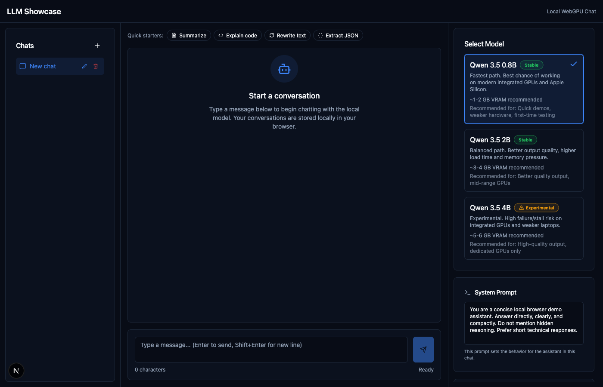
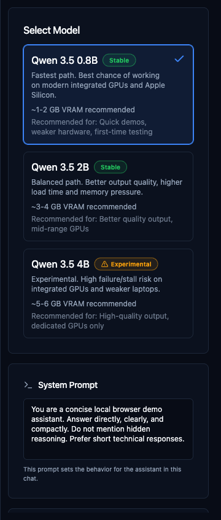
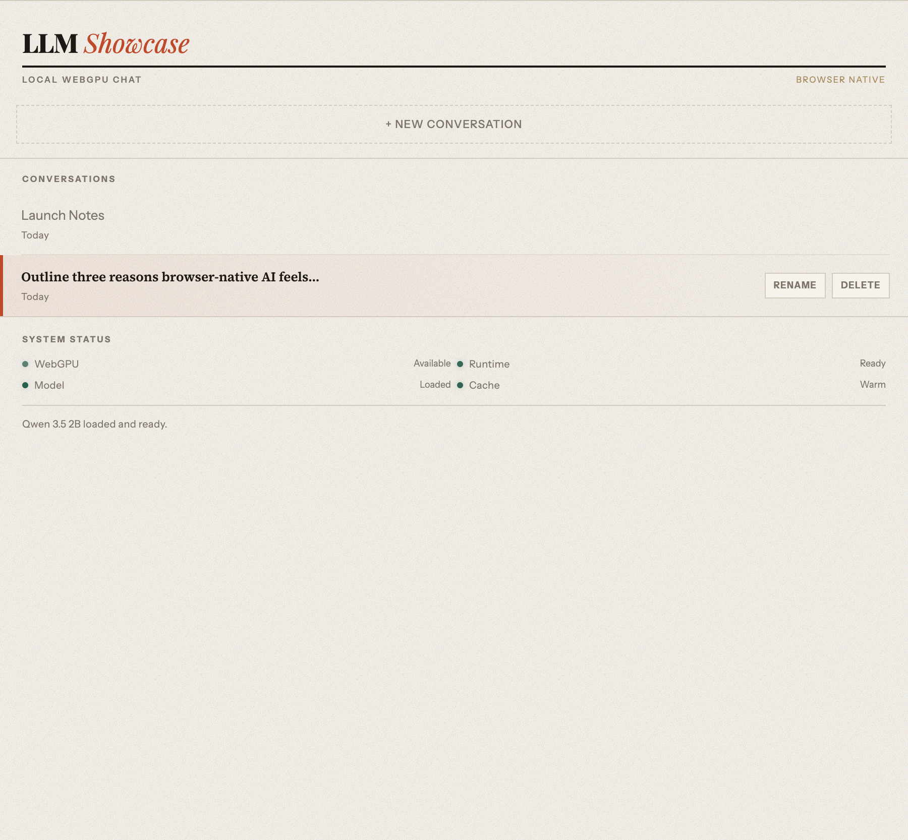

# LLM Showcase — Local-First WebGPU Chat

[](https://github.com/oglenyaboss/llmshowcase/actions/workflows/ci.yml)
[](https://opensource.org/licenses/MIT)

A browser-native Qwen showcase with WebGPU inference, persistent local history, adjustable generation controls, and an editorial production-ready interface.

**[Live Demo](https://llmshowcase.vercel.app)** *(coming soon — deploy your own below)*

## Origin Story

This project started with a Reddit comment. Someone mentioned how cool it would be to run a tiny LLM directly in the browser. At the time, only very small models were feasible. But I saw that Qwen 3.5 had just been released with ONNX exports — and realized we could push the limits. What if we could run a 4B parameter model entirely client-side with WebGPU?

This showcase is the result: an experiment in how far browser-native AI can go.

## Features

- 🖥️ **Editorial showcase layout** with browser-native chat workspace
- 💬 **Multi-chat sidebar** with create, select, rename, and delete capabilities
- ⚡ **Streaming responses** with interrupt support
- 💾 **Persistent local history** via IndexedDB
- 🎛️ **Adjustable inference settings** (temperature, top-p, top-k, repetition penalty, max tokens)
- 📊 **Context window gauge** with approximate prompt-budget tracking
- 🧠 **Thinking mode** support for Qwen 2B and 4B models
- 🔒 **Privacy-first** — all data stays local, no server calls

## Quick Start

```bash
# Clone the repository
git clone https://github.com/oglenyaboss/llmshowcase.git
cd llmshowcase

# Install dependencies
npm install

# Start development server
npm run dev
```

Open [http://localhost:3000](http://localhost:3000) in Chrome 113+ or Edge 113+.

## Models

| Model | Size | Tier | Thinking | Recommended For |
|-------|------|------|----------|-----------------|
| Qwen 3.5 0.8B | ~500MB | Stable | ❌ | Quick demos, weaker hardware |
| Qwen 3.5 2B | ~1.5GB | Stable | ✅ | Better quality, mid-range GPUs |
| Qwen 3.5 4B | ~2.5GB | Experimental | ✅ | High quality, dedicated GPUs |

## Browser Support

| Browser | Version | Status |
|---------|---------|--------|
| Chrome | 113+ | ✅ Recommended |
| Edge | 113+ | ✅ Supported |
| Safari | TP+ | ⚠️ Experimental (enable WebGPU) |
| Firefox | — | ❌ Not supported (no WebGPU) |

## Privacy

All data stays local. Your chats never leave your browser:

- ✅ No server calls for inference
- ✅ Chat history stored in IndexedDB locally
- ✅ Model weights downloaded once and cached
- ✅ Full privacy—no data leaves your device

## Documentation

- [Architecture Overview](./docs/architecture.md) — System design and data flow
- [Contributing Guide](./CONTRIBUTING.md) — How to contribute
- [Changelog](./CHANGELOG.md) — Version history

## Scripts

| Command | Description |
|---------|-------------|
| `npm run dev` | Start development server |
| `npm run build` | Production build |
| `npm run start` | Start production server |
| `npm run lint` | Run ESLint |
| `npm run test` | Run unit tests (Vitest) |
| `npm run test:e2e` | Run E2E tests (Playwright) |

## Deploy Your Own

[](https://vercel.com/new/clone?repository-url=https://github.com/oglenyaboss/llmshowcase)

## Limitations

- One model loaded at a time
- WebGPU required—no CPU/WASM fallback
- Actual VRAM cannot be queried reliably from browsers
- Model weights downloaded on first load (may take time)
- 4B model experimental—may fail on integrated GPUs

## Screenshots





## Tech Stack

- **Framework:** Next.js 16, React 19
- **Inference:** Transformers.js, ONNX Runtime Web
- **Styling:** Tailwind CSS
- **Testing:** Vitest, Playwright
- **Persistence:** IndexedDB

## License

[MIT](./LICENSE)